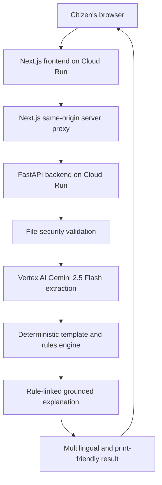
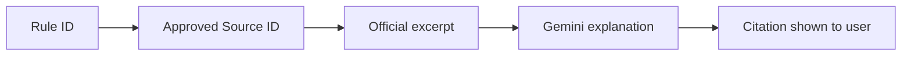

# 🇮🇳 DocSureInd — Check Once. Submit with Confidence.

### How I built an AI-powered application-readiness platform that finds document problems *before* a citizen reaches the application counter

*By Sakthivel Karthikeyan, Software Engineer*

---

## ☀️ A morning that repeats itself

It is 8:40 a.m. outside a district application centre. A college student has taken the day off to submit her post-matric scholarship application. She has a folder full of documents — community certificate, income certificate, bank passbook, mark sheets, Aadhaar photocopy.

At the counter, a clerk glances at two papers and says four words: *"Name mismatch. Please correct."*

Her community certificate reads **S. Priya**. Her bank passbook reads **Priya Selvam**. Nothing is fake. Nothing is wrong, exactly. But the application cannot move forward today, and she will lose another day of classes returning next week.

This is not a rare story. It is a Tuesday.

DocSureInd exists for that folder — and for that morning.

---

## 🧩 The problem: applications fail on small, boring details

Indian public-service applications usually combine documents issued by **different departments, in different years, using different transliteration conventions**. Each document is individually valid. Together, they may not agree.

The most common reasons an application stalls are unglamorous:

- A required supporting document is missing entirely
- The name is spelled differently across certificates
- The date of birth differs between two documents
- A certificate has quietly expired
- A scan is too dark, skewed, or blurred to read
- The instructions themselves are confusing, or only available in English
- The applicant discovers all of this **at the counter**, not at home

The cost is not paperwork. It is repeated travel, lost wages, missed deadlines, and — for scholarships in particular — sometimes a missed academic year.

> **The failure usually happens before submission. So the check should happen before submission too.**

---

## 🤖 Why a normal chatbot is not enough

The obvious answer in 2026 is "just ask an AI chatbot." I tried that first, and it breaks in three specific ways.

**1. A chatbot invents requirements.** Ask a general model which documents a Tamil Nadu post-matric scholarship needs, and you will get a fluent, plausible, *unverifiable* list. For a citizen standing to lose a scholarship, plausible is not good enough.

**2. A chatbot is non-deterministic.** Ask the same question twice, get two slightly different checklists. Government requirements are rules, not opinions. Rules must produce the same answer every single time.

**3. A chatbot cannot show its evidence.** "Trust me" is not an acceptable answer when someone is about to travel 30 kilometres on the strength of it.

DocSureInd's design starts from accepting those three limits rather than pretending they do not exist.

---

## ✅ The DocSureInd solution

**DocSureInd** is an application-readiness platform. A user picks a supported application, answers a short questionnaire, uploads their documents, and receives a structured readiness verdict with specific, explainable issues.

The architectural principle that everything else follows from is a single sentence:

> ### "Gemini reads the documents, deterministic rules validate them, and reviewed official evidence explains the result."

Three responsibilities, three different mechanisms, deliberately kept apart:

| Job | Handled by | Why |
| --- | --- | --- |
| Understanding messy scans | Vertex AI Gemini 2.5 Flash | Only a multimodal model can read a skewed photograph of a 2011 certificate |
| Deciding pass or fail | Deterministic rule templates | Rules must be repeatable, versioned, and auditable |
| Explaining the verdict | Rule-linked grounded retrieval | Explanations must cite reviewed official text, not model memory |

The platform currently demonstrates **narrowly scoped templates** for three workflows:

1. **Tamil Nadu Post-Matric Scholarship** for BC/MBC/DNC students
2. **Fresh Ordinary Passport** for an adult applicant
3. **PAN Data Correction** for an individual applicant

Templates are made publicly available only after their rules and sources have been reviewed. DocSureInd does **not** claim to support every Indian government application — and it blocks unsupported scenarios with a clear message rather than guessing.

---

## 🔄 The end-to-end journey

Let me walk through Priya's folder as DocSureInd actually processes it.

**She selects** the post-matric scholarship template. The frontend loads a template-specific questionnaire — course type, category, hostel or day-scholar status. Her answers determine which rules apply.

**She uploads** her documents as PDF or image files. Before a single token reaches the model, the backend validates file extension, MIME type, magic bytes, structural integrity, size, file count, and PDF page count. Spoofed and structurally invalid uploads never make it to the next stage.

**Gemini reads** each document multimodally and returns structured JSON — holder name, certificate number, date of birth, annual income, issue date, expiry date — each field carrying a confidence score and a short evidence snippet.

**The rules engine decides.** A deterministic policy engine resolves `all_of`, `one_of`, `conditional`, and `recommended` rules against her answers and her extracted fields. RapidFuzz performs correction-aware textual name comparison, so it can tell the difference between an initial-expansion variant and two genuinely different people.

**The system classifies** the package into one of four states:

- `READY`
- `CORRECTIONS_REQUIRED`
- `MANUAL_REVIEW_REQUIRED`
- `UNABLE_TO_VERIFY`

Priya gets `CORRECTIONS_REQUIRED`, with one issue: a name inconsistency between two documents.

**She asks why.** The backend retrieves the reviewed official excerpt linked to that specific rule, and Gemini explains *only that retrieved evidence* — in simple English, Tamil, or Hindi. She listens to it in Tamil using browser speech synthesis, then generates a masked, print-friendly readiness report to carry with her.

She now knows, at home, what she would otherwise have learned at the counter.

---

## 🏗️ Architecture and technology choices

The browser only ever calls relative routes such as `/api/analyze`, `/api/translate`, and `/api/assistant`. The Next.js server proxies these to FastAPI using a **server-only** `API_URL` environment variable, so the backend address is never shipped to the client and no credentials are exposed.

**Frontend:** Next.js 16 with App Router, React, TypeScript, Tailwind CSS, server-side Route Handlers, Web Speech API, and print-specific CSS.

**Backend:** Python, FastAPI, Uvicorn, Pydantic v2, Google GenAI SDK, RapidFuzz, PyMuPDF, and Pillow.

**Cloud:** Cloud Run for both services, Vertex AI Gemini 2.5 Flash, Cloud Build, Artifact Registry, IAM service accounts, and Cloud Logging.

---

## ✨ Why Gemini is essential

Real citizen documents are not clean PDFs. They are phone photographs taken at an angle, decade-old scans, bilingual certificates with Tamil and English side by side, and stamps overlapping printed text.

Classical OCR plus regular expressions collapses on this input. Gemini 2.5 Flash handles it because it reads **layout, language, and semantics together** — it understands that a particular string is the holder's name because of where it sits and what surrounds it, not because it matched a pattern.

Just as importantly, Gemini returns **structured JSON with per-field confidence**. That confidence is what allows the system to say "I am not sure" instead of quietly guessing.

---

## ⚖️ Why deterministic rules are also essential

Here is the design decision I would defend hardest: **Gemini never decides whether an application passes.**

Government requirements are not generated by the model. They live in versioned rule templates that a human has reviewed. This buys four properties a pure-LLM system cannot offer:

- **Repeatability** — the same package always produces the same verdict
- **Auditability** — every issue carries a stable `rule_id` you can trace
- **Versioning** — when official guidance changes, the rule version changes, deliberately
- **Safe escalation** — low-confidence critical fields route to `MANUAL_REVIEW_REQUIRED` rather than being guessed

> **An AI that guesses confidently is more dangerous here than an AI that admits uncertainty.**

---

## 📚 How grounded explanations work

Every validation issue carries a `rule_id`. That rule references approved `source_ids` in a curated repository of reviewed official-source excerpts. When a user asks for an explanation, the backend retrieves those exact excerpts *first*, then asks Gemini to explain only what was retrieved.

Every grounded response returns the explanation, source title, department or authority, reviewed official-source URL, the exact excerpt, and the retrieved/reviewed date. If no evidence is available, the system returns a **not-grounded** response rather than inventing an authoritative answer.

A clarification for the judges, because the word "RAG" is overloaded: this is **rule-linked grounded retrieval**, not vector RAG. There is no vector database, no embedding similarity, no LangChain, no LangGraph, no Vertex AI Search, no live web search, and no autonomous agent framework. Retrieval is curated and rule-linked — which, for a compliance-style domain, is a feature rather than a compromise.

The grounded repository contains **only public guideline excerpts. User certificates are never added to it.**

---

## 🔐 Privacy, security and responsible AI

> ⚠️ **Prototype warning:** For this competition prototype, use only synthetic or properly redacted documents. Do not upload actual Aadhaar, PAN, passport, bank, or other sensitive identity documents.

Input handling is deliberately strict: maximum six files per request, 8 MB per file, 24 MB per request, and ten pages per PDF. Allowed types are PDF, JPG/JPEG, and PNG, checked by extension, MIME type, **and** magic bytes. PyMuPDF verifies PDF structure and Pillow verifies images; password-protected and corrupted PDFs are rejected. SHA-256 hashing detects exact duplicate uploads.

To be precise about what this is: **input checks reject unsupported, spoofed, or structurally invalid uploads.** It is not malware scanning, and I do not describe it as such.

On privacy: uploaded files are processed in memory, extracted identity values are kept out of operational logs, and print reports mask sensitive values. Note also that Vertex AI processing may occur in the configured model region — I make no claim that all processing remains within India.

---

## 🗣️ Multilingual accessibility

An explanation a citizen cannot read is not an explanation. Grounded explanations are generated in **simple English, Tamil, or Hindi**, and the Web Speech API reads results aloud in the browser for users who find listening easier than reading. The print-friendly report is designed for the very real scenario where someone wants a masked paper checklist to carry to the centre.

---

## ☁️ Deployment to GCP

Both services deploy to Cloud Run through a scripted pipeline in `deployment/`. The script loads configuration, enables required APIs, creates or reuses the runtime service account, grants Vertex AI User permission, deploys FastAPI, runs a health check, captures the backend URL, deploys Next.js with `API_URL` injected server-side, and prints both URLs.

No service-account JSON keys are used anywhere. Cloud Run uses an attached IAM service account, which is the pattern I would want in production too.

---

## 🧪 Testing and validation strategy

The backend is covered by Pytest unit tests across template resolution, requirement validation, status classification, file security checking, duplicate handling, and grounded retrieval. Live Vertex AI integration tests exist but are **opt-in**, gated behind an environment flag so that ordinary test runs never incur model cost.

Beyond unit tests, I validated against `[NUMBER_OF_TEST_PACKAGES]` synthetic document packages seeded with `[KNOWN_ISSUES]` deliberate defects — mismatched names, expired certificates, missing documents, unreadable scans.

- Issue detection rate on the seeded set: `[DETECTION_RATE]`
- Median end-to-end processing time: `[MEDIAN_PROCESSING_TIME]`
- Test count and coverage: `[TEST_COUNT]`, `[COVERAGE_PERCENTAGE]`

*(These placeholders are intentional. I would rather ship a README with blanks than a README with numbers I cannot reproduce on demand.)*

---

## 🚧 Limitations — stated plainly

- DocSureInd is **not** an official government platform.
- It does not grant or guarantee approval.
- It does not prove identity.
- It does not verify document authenticity against government databases.
- Only published, reviewed workflows are shown to normal users.
- Low-quality or unusual documents may require manual verification.
- Application requirements change; rules must be reviewed and re-versioned when official guidance changes.
- This prototype should be tested with synthetic or redacted documents only.
- Browser speech quality depends on the voices installed on the user's system.
- Current grounding is curated and rule-linked, not vector-based semantic search.

---

## 🛣️ Future roadmap

Everything below is planned, not built:

- **Additional reviewed templates**, prioritising high-friction workflows such as **visa applications** and **bank loan document checklists**
- Known-source change monitoring, so rule drift is detected rather than discovered
- A human-reviewed template update workflow with a `[DOMAIN_REVIEWER_ROLE]` sign-off step
- An authenticated reviewer portal
- Stronger service-to-service authentication between Cloud Run services
- Support for more Indian languages
- Direct collaboration with application centres
- Optional semantic retrieval over approved official sources
- Accessibility and offline-friendly improvements

---

## 🎯 Conclusion

The interesting problem in civic technology is rarely raw model capability. It is **knowing which decisions an AI should make, and which it should never be allowed to make.**

DocSureInd draws that line explicitly. Gemini does what only a multimodal model can do — read difficult real-world documents. Deterministic, versioned rules do what only rules should do — decide. Reviewed official excerpts do what only evidence can do — justify the answer to the person affected by it.

If that separation holds, a student like Priya finds out about a name mismatch on a Sunday evening at home, instead of on a Tuesday morning at a counter.

## 🌐 Links & Demos

* **Live demo:** [DocSureInd Staging App](https://drive.google.com/file/d/1jzdqWrkh7EIbgXODGnUw_DjjQ3WArAjN/view?usp=sharing)
* **Access Application:** [docsureind.com](https://docsureind-web-staging-lxanronfuq-el.a.run.app/)

> ⚠️ **Notice:** When testing the staging demonstration, please use **synthetic or redacted documents only**.

Feedback, rule corrections, and reviewed-source contributions are all genuinely welcome. The rules are the hard part, and rules get better with more eyes on them.

---

> **Disclaimer:** DocSureInd is an independent application-preparation assistant. It is not affiliated with, endorsed by, or operated by any government authority. Its results do not guarantee application acceptance or approval. Always confirm requirements through the relevant official authority.
