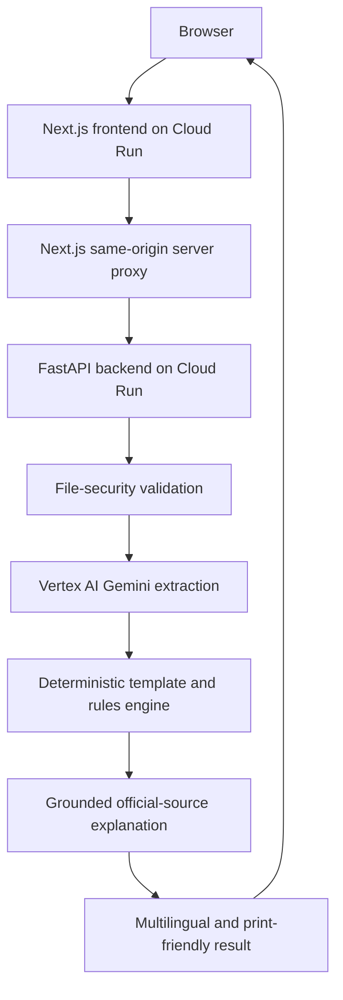
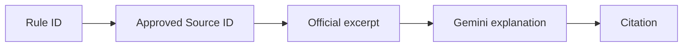

<div align="center">

# 🇮🇳 DocSureInd

### Documents Sure, India

**Check once. Submit with confidence.**


</div>

---

DocSureInd is an AI-powered **application-readiness platform** that helps users detect missing documents, field inconsistencies, expired certificates, and unreadable information **before** submitting Indian public-service applications.

> **"Gemini reads the documents, deterministic rules validate them, and reviewed official evidence explains the result."**

---

## ⚠️ Staging demonstration — read this first

**🔗 Live demo:** https://docsureind-web-staging-lxanronfuq-el.a.run.app

> **Staging demonstration — use synthetic or redacted documents only.**
>
> For this competition prototype, use only synthetic or properly redacted documents. **Do not upload actual Aadhaar, PAN, passport, bank, or other sensitive identity documents.**
>
> Vertex AI processing may occur in the configured model region. No claim is made that all processing remains within India.

---

## 🧩 Problem statement

Citizens prepare government applications using documents issued by different departments, in different years, under different transliteration conventions. Applications are commonly delayed because of:

- Missing supporting documents
- Name differences across certificates
- Date-of-birth inconsistencies
- Expired certificates
- Unreadable or low-quality scans
- Confusing application instructions
- Difficulty understanding requirements written in English
- Repeated visits to application centres

Each of these is discoverable **before** travelling to an application centre. DocSureInd is built to discover them.

---

## ⭐ Key features

- **Template-driven checks** — each supported application has its own reviewed, versioned rule template
- **Multimodal document reading** — Vertex AI Gemini 2.5 Flash reads PDFs and images, including skewed and bilingual scans
- **Deterministic validation** — `all_of`, `one_of`, `conditional`, and `recommended` rules resolved server-side
- **Correction-aware name matching** — RapidFuzz comparison that tolerates initial expansions and transliteration variants
- **Four-state readiness verdict** — `READY`, `CORRECTIONS_REQUIRED`, `MANUAL_REVIEW_REQUIRED`, `UNABLE_TO_VERIFY`
- **Grounded explanations with citations** — every explanation is backed by a reviewed official-source excerpt
- **Multilingual output** — simple English, Tamil, or Hindi
- **Listen to results** — browser speech synthesis via the Web Speech API
- **Masked print-friendly report** — a paper checklist that hides sensitive values
- **Strict input security** — extension, MIME type, magic-byte, structural, size, count, and page-count checks
- **Safe escalation** — low-confidence critical fields are routed to manual review instead of being guessed

---

## 📋 Supported workflows

The platform demonstrates **narrowly scoped** templates for:

| # | Workflow | Scope |
| --- | --- | --- |
| 1 | Tamil Nadu Post-Matric Scholarship | BC / MBC / DNC students |
| 2 | Fresh Ordinary Passport | Adult applicant |
| 3 | PAN Data Correction | Individual applicant |

Templates are made publicly available **only after their rules and sources have been reviewed**. DocSureInd does not support every Indian government application, and unsupported scenarios are blocked with a clear message rather than being answered speculatively.

---

## 🔄 How it works

1. The user selects an application template.
2. The frontend loads a template-specific questionnaire.
3. Unsupported scenarios are blocked with a clear message.
4. The user uploads synthetic or properly redacted PDF/JPG/PNG documents.
5. The backend validates file extension, MIME type, magic bytes, structural integrity, size, file count, and PDF page count.
6. Vertex AI Gemini 2.5 Flash reads the documents multimodally.
7. Gemini returns structured fields such as holder name, certificate number, date of birth, annual income, issue date, and expiry date.
8. A deterministic policy engine resolves `all_of`, `one_of`, `conditional`, and `recommended` rules.
9. RapidFuzz performs correction-aware textual name comparisons.
10. The system detects missing documents, expiry problems, field inconsistencies, duplicates, and low-confidence fields.
11. The result is classified as `READY`, `CORRECTIONS_REQUIRED`, `MANUAL_REVIEW_REQUIRED`, or `UNABLE_TO_VERIFY`.
12. The user can request a grounded explanation for any detected issue.
13. The backend retrieves reviewed official excerpts linked directly to the relevant rule.
14. Gemini explains **only the retrieved evidence**, in simple English, Tamil, or Hindi.
15. The user can listen to the result using browser speech synthesis.
16. The user can generate a masked, print-friendly readiness report.

---

## 🏗️ Architecture



The browser calls relative routes only:

- `/api/analyze`
- `/api/translate`
- `/api/assistant`

The Next.js server proxies these requests to FastAPI using the **server-only** `API_URL` environment variable. No secrets or service-account keys are exposed to the client.

---

## 🛠️ Technology stack

**Frontend**

- Next.js 16 with App Router
- React
- TypeScript
- Tailwind CSS
- Next.js server-side Route Handlers
- Web Speech API
- Print-specific CSS

**Backend**

- Python
- FastAPI
- Uvicorn
- Pydantic v2
- Google GenAI SDK
- RapidFuzz
- PyMuPDF
- Pillow

**Cloud**

- Google Cloud Run (frontend and backend)
- Vertex AI Gemini 2.5 Flash
- Cloud Build
- Artifact Registry
- IAM service accounts
- Cloud Logging

**Testing**

- Pytest
- Unit tests for template resolution, validation, status classification, file checking, duplicate handling, and grounded retrieval
- Opt-in live Vertex AI integration tests

---

## 🤖 AI and grounding approach

### Why the separation matters

- Gemini is used for **multimodal document understanding** and **natural-language explanation**.
- Government requirements are **not invented by Gemini**.
- Deterministic, versioned rule templates perform validation.
- Uncertain fields are escalated for manual review instead of being guessed.
- Rule-linked official excerpts are used for grounded explanations.

### Rule-linked grounded retrieval

Every validation issue carries a stable `rule_id`. That rule references approved `source_ids` in a curated repository of reviewed official-source excerpts. The assistant retrieves those exact excerpts **before** asking Gemini to explain the issue.



Every grounded response contains:

- Explanation
- Source title
- Department or authority
- Reviewed official-source URL
- Exact source excerpt
- Retrieved/reviewed date

If evidence is unavailable, the system returns a **not-grounded** response rather than inventing an authoritative answer. Gemini does not independently verify URLs; sources are **reviewed official-source URLs**.

### What is *not* used

This implementation is **not vector RAG**. It uses no vector database, no embedding-based similarity, no LangChain, no LangGraph, no Vertex AI Search, no live web search, and no autonomous agent framework. Describe it as **rule-linked grounded retrieval**, **retrieval-grounded explanation**, or **curated RAG-style grounding**.

The grounded repository contains **only public guideline excerpts — never user certificates.**

### Extensibility

The flexible extraction schema can be extended to support additional registered document types without redesigning the core response model:

```python
class ExtractedField(BaseModel):
    value: str | None
    confidence: float
    evidence: str | None


class ExtractedDocument(BaseModel):
    document_type: str
    document_type_confidence: float
    fields: dict[str, ExtractedField]
    warnings: list[str]
```

Supporting a new document still requires:

1. Registering the document type
2. Defining extraction fields
3. Adding reviewed rules
4. Linking official sources
5. Adding tests

---

## 📁 Repository structure

```text
docsureind/
├── frontend/
│   ├── app/
│   │   ├── applications/
│   │   ├── check/
│   │   ├── api/
│   │   ├── privacy/
│   │   └── about/
│   ├── Dockerfile
│   └── package.json
├── backend/
│   ├── app/
│   │   ├── services/
│   │   ├── rag/
│   │   ├── main.py
│   │   ├── models.py
│   │   ├── extraction.py
│   │   ├── validation.py
│   │   └── config.py
│   ├── tests/
│   ├── Dockerfile
│   └── requirements.txt
├── deployment/
│   ├── staging.config.ps1
│   └── deploy-staging.ps1
├── test-data/
├── README.md
└── BLOG.md
```

---

## 🔌 API overview

| Method | Endpoint | Purpose |
| --- | --- | --- |
| `GET` | `/health` | Service health check |
| `GET` | `/api/v1/templates` | List available application templates |
| `GET` | `/api/v1/templates/{template_id}` | Fetch a single template definition |
| `POST` | `/api/v1/requirements/resolve` | Resolve required documents from questionnaire answers |
| `POST` | `/api/v1/analyze` | Analyse an uploaded document package |
| `POST` | `/api/v1/translate` | Translate result text |
| `POST` | `/api/v1/assistant/query` | Request a grounded explanation for an issue |

`POST /api/v1/analyze` accepts **multipart form data**:

| Field | Description |
| --- | --- |
| `template_id` | Selected application template |
| `template_version` | Template version in use |
| `answers_json` | Questionnaire answers as JSON |
| `files` | Uploaded documents |

> The backend resolves rules **server-side**. It never accepts validation rules from the browser.

---

## 💻 Local setup

### Prerequisites

- Python 3.11 or 3.12
- Node.js 20 or 22
- Google Cloud CLI
- A GCP project with billing enabled
- Vertex AI API enabled
- Application Default Credentials for local Vertex testing

### Backend

```powershell
cd backend
python -m venv venv
.\venv\Scripts\Activate.ps1
pip install -r requirements.txt

gcloud auth application-default login

$env:GOOGLE_CLOUD_PROJECT="your-project-id"
$env:VERTEX_LOCATION="us-central1"
$env:GEMINI_MODEL="gemini-2.5-flash"
$env:APP_ENV="local"

uvicorn app.main:app --reload --port 8080
```

### Frontend

```powershell
cd frontend
npm install

$env:API_URL="http://127.0.0.1:8080"
npm run dev
```

### Local URLs

- Frontend: `http://localhost:3000`
- Backend health: `http://127.0.0.1:8080/health`
- Swagger docs: `http://127.0.0.1:8080/docs`

> Environment variable names must match the current implementation exactly.

---

## 🔑 Environment variables

| Variable | Used by | Purpose |
| --- | --- | --- |
| `GOOGLE_CLOUD_PROJECT` | Backend | GCP project ID |
| `VERTEX_LOCATION` | Backend | Vertex AI model location |
| `GEMINI_MODEL` | Backend | Gemini model identifier |
| `APP_ENV` | Both | Runtime environment |
| `API_URL` | Frontend server | FastAPI backend URL |
| `RUN_LIVE_VERTEX_TESTS` | Tests | Enables paid live integration tests |

**Rules that are not negotiable:**

- Never commit `.env` files.
- Never commit service-account JSON keys.
- Cloud Run should use an attached IAM service account.
- `API_URL` is server-side and **must not** use the `NEXT_PUBLIC_` prefix.

---

## 🧪 Running tests

### Unit tests

```powershell
cd backend
.\venv\Scripts\python.exe -m pytest `
  -v `
  -m "not integration" `
  --cov=app `
  --cov-report=term-missing
```

### Live Vertex AI integration tests (opt-in, incurs cost)

```powershell
$env:RUN_LIVE_VERTEX_TESTS="1"
$env:GOOGLE_CLOUD_PROJECT="your-project-id"
$env:VERTEX_LOCATION="us-central1"

.\venv\Scripts\python.exe -m pytest -v -m integration
```

### Frontend build

```powershell
cd frontend
npm run build
```

**Current metrics:** `[TEST_COUNT]` tests, `[COVERAGE_PERCENTAGE]` coverage, `[ISSUE_DETECTION_RATE]` issue detection rate on the seeded synthetic set.

> Replace these placeholders with confirmed, reproducible values before publishing. Do not publish invented benchmark results. Build-passing and coverage badges are intentionally omitted because no public CI URL exists yet.

---

## ☁️ GCP deployment

The repository includes:

- `deployment/staging.config.ps1`
- `deployment/deploy-staging.ps1`

```powershell
Set-ExecutionPolicy -Scope Process -ExecutionPolicy Bypass
.\deployment\deploy-staging.ps1
```

The script:

1. Loads GCP deployment configuration
2. Enables required APIs
3. Creates or reuses the runtime service account
4. Grants Vertex AI User permission
5. Deploys FastAPI to Cloud Run
6. Runs a health check
7. Captures the backend URL
8. Deploys Next.js with `API_URL`
9. Prints the frontend and backend URLs

> No real service-account credentials are included in this repository, and none should ever be added.

---

## 🔐 Security and privacy

### Input limits

| Control | Limit |
| --- | --- |
| Files per request | 6 |
| Size per file | 8 MB |
| Total request size | 24 MB |
| Pages per PDF | 10 |
| Allowed types | PDF, JPG/JPEG, PNG |

### Input validation

- Extension, MIME type, and magic-byte checks
- PyMuPDF PDF structural verification
- Pillow image verification
- Password-protected and corrupted PDFs are rejected
- SHA-256 detects exact duplicate uploads

> **Input checks reject unsupported, spoofed, or structurally invalid uploads.**
> This is **not** malware scanning and is not described as such.

### Data handling

- Uploaded files are processed **in memory**
- User documents are **not** added to the grounded-source repository
- Extracted identity values should not appear in operational logs
- Print reports mask sensitive values
- Low-confidence critical fields require manual review
- Vertex AI processing may occur in the configured model region

---

## 🧭 Responsible-AI principles

1. **The model reads; rules decide.** Gemini never issues the pass/fail verdict.
2. **Requirements are human-reviewed and versioned**, never model-generated.
3. **Uncertainty is surfaced, not hidden.** Low confidence escalates to manual review.
4. **Every explanation is grounded and cited**, or explicitly marked not-grounded.
5. **Scope is stated honestly.** Unsupported scenarios are blocked, not guessed.
6. **Privacy by default.** In-memory processing, masked reports, no user data in the source repository.

---

## 🚧 Limitations

- DocSureInd is **not** an official government platform.
- It does not grant or guarantee approval.
- It does not prove identity.
- It does not verify document authenticity against government databases.
- Only published, reviewed workflows are shown to normal users.
- Low-quality or unusual documents may require manual verification.
- Application requirements may change.
- Rules must be reviewed and versioned when official guidance changes.
- This prototype should be tested with synthetic or redacted documents.
- Browser speech quality depends on installed system voices.
- Current grounding is curated and rule-linked, **not** vector-based semantic search.

---

## 🛣️ Roadmap

Planned, not yet implemented:

- Additional reviewed application templates — prioritising **visa applications** and **bank loan document checklists**
- Known-source change monitoring
- Human-reviewed template update workflow
- Authenticated reviewer portal
- Stronger service-to-service authentication
- More Indian languages
- Direct collaboration with application centres
- Optional semantic retrieval over approved official sources
- Accessibility and offline-friendly improvements

---

## 🤝 Contributing

Contributions are welcome, particularly on rules and sources — that is where accuracy is won or lost.

1. Fork the repository and create a feature branch.
2. For a **new template or rule**, include the reviewed official source, the exact excerpt, and the retrieved/reviewed date.
3. For a **new document type**, register the type, define extraction fields, add reviewed rules, link official sources, and add tests.
4. Run `pytest -m "not integration"` and `npm run build` before opening a pull request.
5. Never commit `.env` files, service-account keys, or real identity documents — including in test fixtures.

Please open an issue before starting significant work so scope can be agreed upfront.

---

## 📄 License

Released under `[LICENSE_NAME]`. See [`LICENSE`](LICENSE) for details.

---

## 👤 Author

**Sakthivel Karthikeyan** — Software Engineer

- GitHub: `[GITHUB_PROFILE_URL]`
- LinkedIn: `[LINKEDIN_URL]`
- Email: `[CONTACT_EMAIL]`

---

## ⚖️ Disclaimer

> **DocSureInd is an independent application-preparation assistant. It is not affiliated with, endorsed by, or operated by any government authority. Its results do not guarantee application acceptance or approval. Always confirm requirements through the relevant official authority.**
