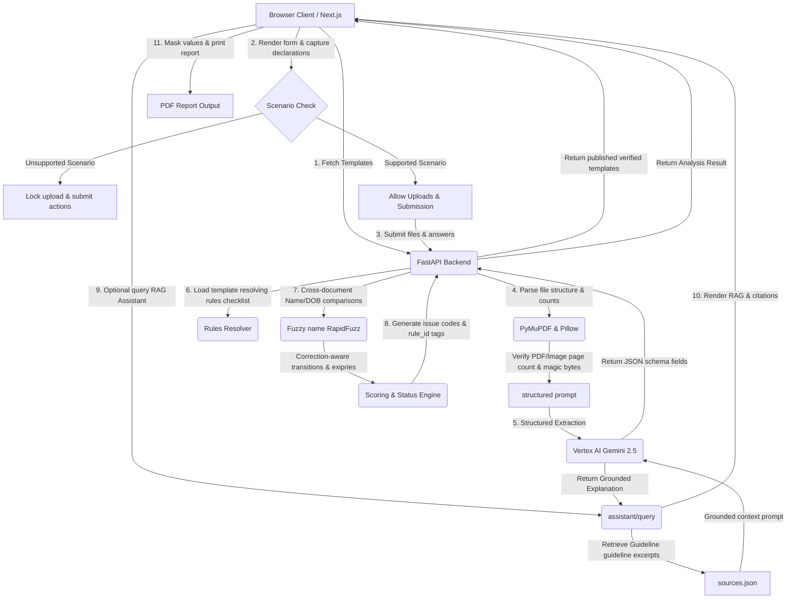

# DocSureInd — System Architecture & Workflow Document

This document details the complete technology stack, deployment components, end-to-end workflow, and system architecture for the **DocSureInd** platform.

---

## 🛠️ Technology Stack & Utilization

| Technology | Layer | Component / File | Purpose & Utilization |
| :--- | :--- | :--- | :--- |
| **Next.js 16 (App Router)** | Frontend | `frontend/app/` | Core user interface framework. Renders landing page, catalog `/applications`, and console `/check`. |
| **TypeScript / React** | Frontend | `frontend/app/check/page.tsx` | Manages page states, dynamic questionnaire render loop, language state hooks, and client-side masking. |
| **TailwindCSS** | Styling | `frontend/global.css` | Premium modern layout styling, responsive grid alignment, and CSS print overrides (`@media print`). |
| **Web Speech API** | Browser Voice | `frontend/app/check/page.tsx` | Provides native text-to-speech reading in Tamil, Hindi, and English with fallback protection. |
| **Fastapi / Uvicorn** | Backend API | `backend/app/main.py` | Exposes application endpoints (`/analyze`, `/templates`, `/assistant/query`, `/translate`). |
| **Pydantic v2** | Data Models | `backend/app/models.py` | Enforces strict schemas for RAG query request/response, validation issues, and extracted fields. |
| **Google GenAI SDK** | AI Integration | `backend/app/extraction.py` | Calls Vertex AI Gemini 2.5 Flash model for structured data extraction and grounded explanation RAG. |
| **RapidFuzz** | Fuzzy Logic | `backend/app/validation.py` | Runs fuzzy string matching (token sort ratio) for correction-aware cross-document name checks. |
| **PyMuPDF (fitz)** | PDF Parser | `backend/app/main.py` | Performs page count limits checking and structural verification for uploaded PDF documents. |
| **Pillow (PIL)** | Image Parser | `backend/app/main.py` | Performs binary magic bytes checking and corruption verification for JPEG and PNG images. |
| **Pytest** | Testing | `backend/tests/` | Evaluates rules resolvers, RAG assistant, and templates (45 tests total). |

---

## 🏗️ System Architecture Diagram

---

## 🔄 End-to-End Workflow Details

### Phase 1: Service Catalog & Scenario Declarations
1. The user navigates to the `/applications` page, fetching templates from `GET /api/v1/templates` (which returns verified templates only for normal users).
2. Selecting a card redirects the user to `/check?template_id=xxxx` to load details from `GET /api/v1/templates/{id}`.
3. The page renders the *Scenario Declarations* dynamically. If the user marks standard declarations as false (e.g. "is_adult_fresh_ordinary" = No), the console locks, preventing document upload.

### Phase 2: Upload, Size, & Signature Validation
1. The user uploads document files (limit: 6 files, 8MB per file, 24MB total).
2. The FastAPI backend verifies file extensions and validates magic bytes signature (`%PDF` for PDFs, `\x89PNG` for PNGs) to reject unsupported, spoofed, or structurally invalid uploads.
3. PyMuPDF verifies page count limits (max 10 pages).

### Phase 3: Gemini Structured Fields Extraction
1. File contents are sent to Gemini 2.5 Flash with instructions to populate the extensible schema `fields` dictionary.
2. Extracted values (e.g. `holder_name`, `certificate_number`, `date_of_birth`) are populated alongside extraction confidence values.

### Phase 4: Rules Resolution & Cross-Document Matching
1. The backend evaluates questionnaire answers against template rules (`all_of`, `one_of`, `conditional`, `recommended`) to resolve a custom required checklist.
2. It compares primary details:
   - **Fuzzy Name Matching**: Compares name tokens using token sort ratio. If names vary under a correction scenario (`correcting_name` = True), it flags a manual review instead of raising a blocking error, provided name change proof exists.
   - **Date of Birth**: Compares birthdates. Mismatches under a DOB correction scenario are routed to manual review rather than blocking errors.
   - **Expiry Date**: Confirms certificate validity against the current date.

### Phase 5: Result Rendering, RAG Assistance, and Printing
1. The client receives the score, status (READY, CORRECTIONS_REQUIRED, MANUAL_REVIEW_REQUIRED), and list of issues.
2. The user can switch languages (English, Tamil, Hindi) which translates the entire layout instantly.
3. For any issue, the user can click **Consult Official Guidelines** to ask custom questions. The backend pulls guideline excerpts from `sources.json`, queries Gemini with grounding constraints, and returns explanation text alongside reviewed official-source URLs and citations.
4. Clicking **Print friendly Report** invokes the print stylesheet, masking fields dynamically (e.g. certificate IDs appear as `••••1234`) and formatting for a clean paper printout.
